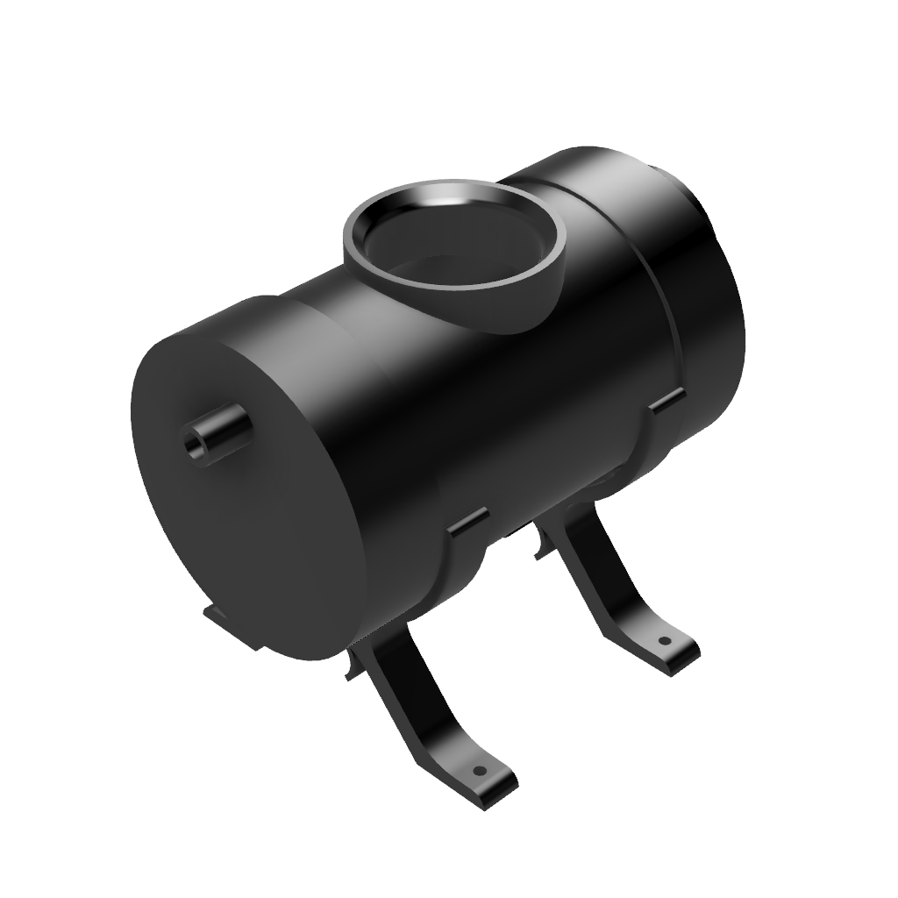

<h1 align="center">
   
  
   
  Horizontal Hydroponics
   
</h1>

<h4 align="center">A simple yet elegant horizontal hydroponics setup.</h4>

  <a href="#key-features">Key Features</a> •
<a href="#how-to-set-up">Set Up</a> •
  <a href="#materials">Materials</a> •
  <a href="#license">License</a>

## Key Features

* 10 plants - 5ft section
* 20 plants - 10ft section
* Custom 3D printed parts
  * Stand
  * Net cup support

## How to set up

### Materials

#### Purchasable Parts

| Name                 |  Price   |  Qty | Link                                                                                                             |
|----------------------|:--------:|-----:|------------------------------------------------------------------------------------------------------------------|
| 3in Pipe             |  $28.46  | 10ft | https://www.lowes.com/pd/Charlotte-Pipe-3-in-x-10-ft-Sch-40-Cellcore-PVC-DWV-Pipe/3133045                        |
| 1.5in Pipe           |  $15.78  | 10ft | https://www.lowes.com/pd/Charlotte-Pipe-1-1-2-in-x-10-ft-330-Sch-40-Solidcore-PVC-DWV-Pipe/3133037               |
| 3in Elbow            |  $4.98   |    2 | https://www.lowes.com/pd/PVC-3-in-x-3-in-dia-90-Degree-Elbow/5001842339                                          |
| 3in to 1.5in Reducer |  $7.11   |    1 | https://www.lowes.com/pd/Charlotte-Pipe-1-1-2-in-x-3-in-dia-PVC-Schedule-40-Hub-Adapter-Coupling-Fitting/3132739 |
| Tubing               |  $10.48  | 20ft | https://www.lowes.com/pd/smartpond-Black-Pond-Tubing/1000843632                                                  |
> **Notice:**
> Prices varies based on location and time of purchase. This should only be used as a broad estimate

#### 3D Printable parts
| Name  | Qty |        File        |                                      Image                                       |
|-------|:---:|:------------------:|:--------------------------------------------------------------------------------:|
| Cap   | 20  |     Cap v5.stl     |           |
| Stand |  5  | Pipe Holder v8.stl |  |
> **Notice:**
> You do not have permission to redistribute these designs or physical parts for commercial purposes.

### Step 1: Drill Holes
The center of the first 2in diameter hole should be 3in from the end of the pvc pipe. Each additional hole should be at least 6in center to center from the last hole.

### Step 2: Aline and Screw in Stands
Be careful not to screw in the stands all the way since they are plastic and could break if overtightened. Also make sure you leave enough clearance for the fittings at the ends of the pipe for the next step.

### Step 3: Put on the fittings
Put on the 3in 90deg fitting at one end of the pipe. Put on the 3in to 1.5in reducer on the other end of the pipe. Insert the 1.5in 90deg fitting into the 1.5in end of the reducer.

### Step 4: Place on the caps
Simply place the 3D-Printed caps into the 2in hole.

### Step 5: Expand!

## License

Attribution-NonCommercial-ShareAlike 4.0 International

https://creativecommons.org/licenses/by-nc-sa/4.0/

---
> [zlincoln.dev](https://www.zlincoln.dev) &nbsp;&middot;&nbsp;
> GitHub [@ZacharyLincoln](https://github.com/ZacharyLincoln)
